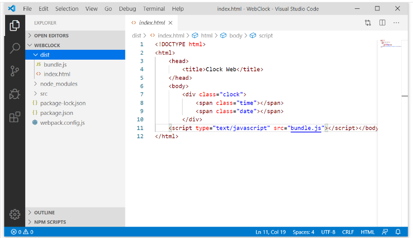

# Menggunakan Plugin
Ketika membuat web application tentunya kita membutuhkan minimal satu berkas HTML yang biasanya dinamai dengan index.html. Dengan menambahkan plugin HtmlWebpackPlugin, Webpack dapat membuatkan berkas HTML dan memasukkan script hasil bundel pada berkas HTML yang dibuat secara otomatis. HtmlWebpackPlugin juga mendukung templating dan penggunaannya sangat dapat dikonfigurasi.

Untuk menggunakan html-webpack-plugin, langkah pertama adalah memasang package html-webpack-plugin pada devDependencies menggunakan npm.

```
npm install html-webpack-plugin --save-dev
```

Setelah memasangnya, pada berkas webpack.config.js lakukan impor package html-webpack-plugin sebagai objek dengan nama HtmlWebpackPlugin.

```
const path = require('path');
const HtmlWebpackPlugin = require('html-webpack-plugin');
 
module.exports = ....
```

Selanjutnya di dalam module.exports mari tambahkan properti plugins dengan nilai berikut:


```
const path = require('path');
const HtmlWebpackPlugin = require('html-webpack-plugin');
 
module.exports = {
  ......,
  /* plugin */
  plugins: [
    /* HTML Webpack Plugin */
    new HtmlWebpackPlugin({
      template: './index.html',
      filename: 'index.html',
    }),
  ],
};
```

Di dalam penggunaan plugin HtmlWebpackPlugin Anda dapat menentukan konfigurasi di dalam konstruktornya. Pada contoh kode di atas Anda menetapkan konfigurasi untuk template dan filename. Template di sana merupakan berkas rujukan bagi pembuatan berkas HTML yang dihasilkan HtmlWebpackPlugin. Lalu nilai dari properti filename akan digunakan sebagai penamaan berkas HTML yang akan dihasilkan nanti.

Mungkin contoh kode di atas membuat Anda sedikit bingung karena kita menetapkan nama yang sama (index.html), baik template dan filename. Padahal Anda dapat menetapkan nama berkasnya sesuai keinginan. Oleh karena itu, mari kita ubah penamaan dan bedakan lokasi dari berkas index.html yang ada sekarang menjadi template.html dan pindahkan ke folder src. 

Dengan begitu struktur proyek akan tampak seperti berikut.


Lalu, kita juga perlu ubah lokasi dari berkas HTML kita yang didefinisikan dalam key template pada webpack configuration menjadi:

```
const path = require('path');
const HtmlWebpackPlugin = require('html-webpack-plugin');
 
module.exports = {
  ......,
  /* plugin */
  plugins: [
    /* HTML Webpack Plugin */
    new HtmlWebpackPlugin({
      template: './src/template.html',
      filename: 'index.html'
    })
  ]
}
```

Oh ya, dikarenakan HtmlWebpackPlugin akan memasukan output script bundle pada berkas HTML yang dihasilkannya secara otomatis, maka kita tidak perlu menetapkan tag <script> secara manual pada berkas template.html. Dengan begitu kita dapat menghapusnya dan struktur HTML-nya menjadi seperti berikut.

```
<!DOCTYPE html>
<html>
<head>
  <title>Clock Web</title>
</head>
<body>
  <div class="clock">
    <span class="time"></span>
    <span class="date"></span>
  </div>
</body>
</html>
```

Setelah menambahkan HtmlWebpackPlugin pada webpack configuration, seluruh kode pada berkas webpack.config.js akan tampak seperti berikut.

```
const path = require('path');
const HtmlWebpackPlugin = require('html-webpack-plugin');
 
module.exports = {
  entry: './src/index.js',
  output: {
    path: path.resolve(__dirname, 'dist'),
    filename: 'bundle.js',
  },
  mode: 'production',
  module: {
    rules: [
      /* style and css loader */
      {
        test: /\.css$/,
        use: [
          {
            loader: 'style-loader',
          },
          {
            loader: 'css-loader',
          },
        ],
      },
    
      /* babel loader */
      {
        test: /\.js$/,
        exclude: /node_modules/,
        use: [
          {
            loader: 'babel-loader',
            options: {
              presets: ['@babel/preset-env'],
            },
          },
        ],
      },
    ],
  },
  
  /* plugin */
  plugins: [
    /* HTML Webpack Plugin */
    new HtmlWebpackPlugin({
      template: './src/template.html',
      filename: 'index.html',
    }),
  ],
};
```

Lakukan build kembali proyek dengan menjalankan perintah npm run build. Dengan demikian, folder dist akan menghasilkan berkas index.html.



Sekarang seluruh komponen yang dibutuhkan untuk menjalankan proyek WebClock sudah terdapat pada folder dist. Untuk menjalankan proyek WebClock kita cukup membuka berkas index.html pada browser. Bahkan sekarang kita bisa mengunggah aplikasi WebClock pada internet dengan men-deploy seluruh berkas yang terdapat pada folder dist. Dengan kata lain, seluruh berkas yang dibutuhkan untuk tahap production sudah terdapat di dalam folder dist.

Selamat! Sejauh ini kita sudah berhasil menggunakan webpack untuk membantu pengembangan aplikasi web hingga ke tahap production. Namun pembahasan webpack belum berakhir di sini yah. Pada materi selanjutnya kita akan belajar fitur lain yang tak kalah menarik, yaitu Webpack Dev Server. Siap? Let’s go!
