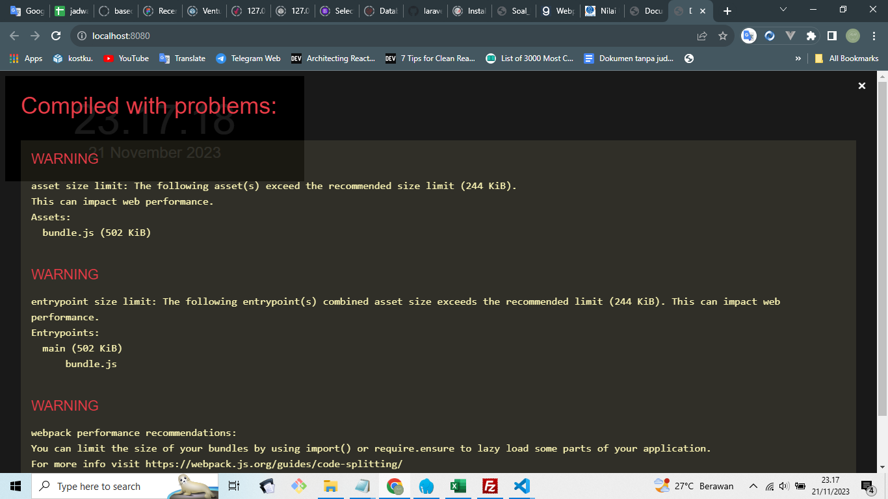
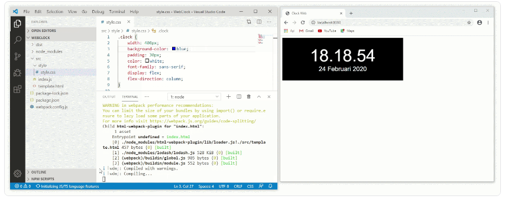

# Webpack Dev Server
Saat ini setiap terjadi perubahan kode pada proyek, Anda perlu melakukan build ulang untuk melihat hasilnya. Tak peduli perubahan tersebut bersifat mayor ataupun hanya sekadar ganti warna saja. Karena untuk melihat perubahan terbaru kita juga perlu memperbaharui berkas bundle.js. Tentu sangat merepotkan, bukan?

Untunglah webpack menyediakan fitur live-reloading yang dapat mempercepat proses pengembangan menggunakan Webpack Dev Server. Dengan ini kita dapat melihat perubahan secara langsung tanpa harus menjalankan ulang perintah build.

Untuk menggunakan Webpack Dev Server langkah pertama adalah kita pasang package webpack-dev-server pada devDependencies menggunakan npm.

```
npm install webpack-dev-server --save-dev
```

Setelah berhasil memasangnya, kita tambahkan script start-dev dengan perintah “webpack serve” pada package.json.

```
"scripts": {
  "build": "webpack",
  "start-dev": "webpack serve"
}
```

Mari kita jalankan script start-dev dengan perintah:

```
npm run start-dev
```

Setelah menjalankan perintah di atas, kita akan mendapatkan alamat localhost:8080 di terminal. Alamat tersebut digunakan untuk melihat proyek yang sedang kita kembangkan pada browser. Jika kita jalankan melalui browser, maka akan tampil seperti berikut.



Mantab! Proyek berhasil dijalankan menggunakan webpack dev server. Tetapi, kenapa halaman web menampilkan overlay dengan pesan-pesan peringatan seperti ini? Ini adalah pesan dari hasil proses compile webpack. Hasil peringatan tersebut menunjukkan kepada developer untuk mengetahui bahwa terdapat beberapa hal yang perlu kita sesuaikan agar proyek yang dibangun semakin baik. Namun, saat ini kita tidak akan fokus pada penyelesaian permasalahan tersebut. Kamu bisa menutup overlay tersebut dengan menekan tombol “X” di pojok kanan atas.

Namun, jika kamu merasa terganggu dengan munculnya overlay di setiap kali proses compile selesai, kamu bisa menyembunyikannya dengan menambahkan sedikit konfigurasi tambahan. Konfigurasi tambahan tersebut adalah menambahkan satu properti bernama devServer. Silakan tambahkan properti tersebut seperti berikut.

```
const path = require('path');
const HtmlWebpackPlugin = require('html-webpack-plugin');
 
module.exports = {
  /* ..... */
  mode: 'production',
  devServer: {
    client: {
      overlay: {
        errors: true,
        warnings: false,
      },
    },
  },
  /* ..... */
}
```

Kemudian, jika kita ingin melihat hasilnya, kita tidak bisa memuat ulang halaman website secara langsung dengan cara refresh halaman. Hal ini dikarenakan terdapat perubahan konfigurasi webpack. Silakan kamu jalankan ulang proses compile menggunakan webpack dev server. Caranya adalah mematikan proses lama terlebih dahulu dan menjalankan npm run start-dev kembali di terminal. Jika kita buka localhost:8080 kembali, pesan peringatan di overlay tidak muncul kembali.

```
....
    errors: true,
    warnings: false,
....
```

Pada konfigurasi tambahan di atas, kita mengatur nilai false pada properti warnings tetapi tidak untuk properti errors. Hal ini dimaksudkan untuk menyembunyikan pesan peringatan dalam halaman web tetapi tidak untuk pesan error. Dengan demikian, hanya pesan kesalahan sajalah akan ditampilkan dalam overlay.

Webpack Dev Server secara standar memiliki fitur live-reloading. Artinya setiap terjadi perubahan terhadap assets yang digunakan (HTML, CSS, atau JS) dan menyimpan perubahannya (save), ia akan melakukan melakukan proses compiling ulang dan menampilkan hasil perubahan langsung pada browser.


Namun jika kita lihat proses compiling memakan waktu yang cukup lama bukan? Pada contoh gif di atas, butuh setidaknya 5 detik untuk Webpack Dev Server menampilkan perubahan terbaru pada browser. Mengapa bisa demikian?

Hal tersebut terjadi karena kita menggunakan mode production dalam menjalankan Webpack Dev Server. Ketika menggunakan mode production maka webpack melakukan bundling module seoptimal mungkin sehingga proses membutuhkan waktu lebih lama dibandingkan dengan mode development. Selain itu, pada webpack configuration kita menggunakan babel-loader. Proses compiling yang lama akan terasa lebih lama lagi karena kita harus melalui proses transpiling kode JavaScript melalui babel-loader. 

Solusinya, pisahkan webpack configuration untuk development dan production.

#### Catatan:
Untuk menghentikan service webpack-dev-server, gunakan kombinasi CTRL+C pada terminal yang digunakan. Ingatlah bahwa sebaiknya kita hentikan service webpack-dev-server setiap kali ingin melakukan perubahan pada berkas webpack configuration.

