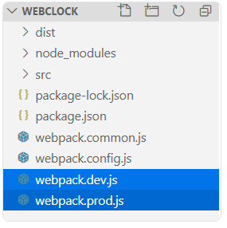

# Mengonfigurasi Webpack berdasarkan Environment
Tujuan dari development dan production memanglah berbeda. Pada tahap development webpack akan menerapkan konfigurasi yang selalu optimal untuk mempercepat proses perubahan pada browser (hot reloading). Sedangkan pada proses production kita ingin fokus terhadap optimasi bundling dan kompatibilitasnya pada browser. Karena perbedaan fokus tersebut sebaiknya kita memisahkan konfigurasi antara keduanya.


Namun jika berpatokan pada bagan di atas, antara keduanya terdapat konfigurasi umum (common) seperti entry, output, style-loader, css-loader dan HtmlWebpackPlugin. Untuk menghindari penulisan berulang, kita dapat menggunakan tools yang bernama webpack-merge yang berfungsi untuk menggabungkan konfigurasi umum dengan konfigurasi unik tiap environment-nya.


### Menggunakan webpack-merge
Untuk menggunakan webpack-merge langkah awal adalah dengan memasang package tersebut pada devDependencies menggunakan NPM.

```
npm install webpack-merge --save-dev
```

Kemudian kita buat berkas webpack konfigurasi baru dengan nama webpack.common.js.


```
const path = require('path');
const HtmlWebpackPlugin = require('html-webpack-plugin');
 
module.exports = {
  entry: './src/index.js',
  output: {
    filename: 'bundle.js',
    path: path.resolve(__dirname, 'dist'),
  },
  module: {
    rules: [
      /* style and css loader */
      {
        test: /\.css$/,
        use: [
          {
            loader: 'style-loader',
          },
          {
            loader: 'css-loader',
          },
        ],
      },
    ],
  },
  /* plugin */
  plugins: [
    /* HTML Webpack Plugin */
    new HtmlWebpackPlugin({
      template: './src/template.html',
      filename: 'index.html',
    }),
  ],
};
```

Kemudian kita buat 2 (dua) berkas webpack configuration baru dengan nama webpack.prod.js dan webpack.dev.js.



Kemudian pada masing-masing berkasnya, tuliskan kode berikut:

webpack.prod.js

```
const { merge } = require('webpack-merge');
const common = require('./webpack.common.js');
 
module.exports = merge(common, {
  mode: 'production',
  module: {
    rules: [
      /* babel loader */
      {
        test: /\.js$/,
        exclude: /node_modules/,
        use: [
          {
            loader: 'babel-loader',
            options: {
              presets: ['@babel/preset-env'],
            },
          },
        ],
      },
    ],
  },
});
```

webpack.dev.js

```
const { merge } = require('webpack-merge');
const common = require('./webpack.common.js'); 
 
module.exports = merge(common, {
  mode: 'development',
});
```

Di dalam berkas webpack.common.js kita sudah menetapkan nilai entry, output beberapa loader, dan plugin yang nilainya digunakan pada kedua environment. Sehingga kita tidak perlu menetapkannya lagi pada masing-masing berkas konfigurasi environment-nya.

Perhatikan juga bahwa kita menggunakan merge() dari package webpack-merge, untuk memasukkan konfigurasi umum pada konfigurasi tiap environment-nya.

```
module.exports = merge(common, ... );
```

Setelah menetapkan konfigurasi umum dan konfigurasi pada tiap environment, mari ubah perintah script build dan start-dev pada package.json menjadi seperti ini:

```
"scripts": {
  "build": "webpack --config webpack.prod.js",
  "start-dev": "webpack serve --config webpack.dev.js"
}
```

Dengan menambahkan flag --config [config-files] pada script build dan start-dev, maka Anda dapat secara leluasa menghapus berkas webpack.config.js karena memang sudah tidak digunakan lagi. Sehingga pada proyek WebClock hanya terdapat 3 (tiga) berkas webpack configuration.


Coba kita jalankan kembali script start-dev ya. Seharusnya fitur live-reloading akan berjalan lebih cepat.


lanjutnya kesini ya reponya: https://github.com/AsepSahrudin18/latihan-webpack.git

Persiapan Proyek Latihan (implementasi webpack langsung)