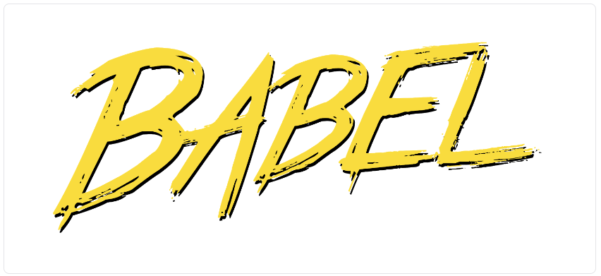
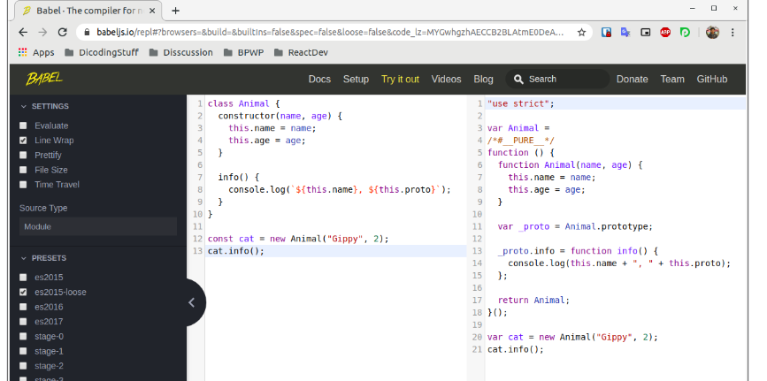
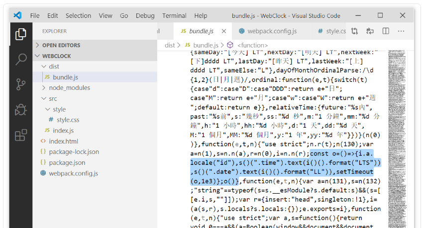
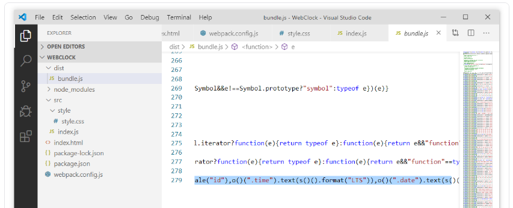
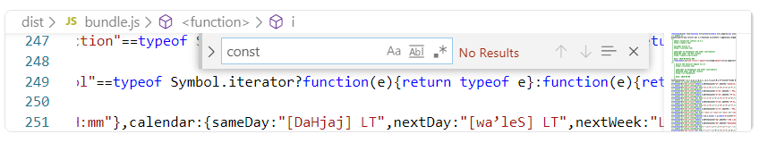

# Babel Loader
Kita sudah berhasil menggunakan dan merasakan manfaat dari style-loader dan css-loader. Namun sebenarnya masih banyak loader lain yang tak kalah pentingnya untuk diterapkan pada webpack. Salah satunya adalah babel-loader. 



Mungkin sebagian dari kita sudah ada yang mengetahui apa itu babel atau babel.js? Babel merupakan sebuah transpiler yang bertugas untuk mengubah sintaks JavaScript modern (ES6+) menjadi sintaks yang dapat didukung penuh oleh seluruh browser.

JavaScript merupakan bahasa pemrograman yang berkembang sangat pesat. Komunitasnya besar, dan tiap tahun selalu terdapat versi yang baru. Namun perkembangan yang pesat tadi ternyata membutuhkan waktu yang lama untuk diadaptasi oleh browser atau Node.js. Lalu jika kita ingin mencoba sintaks terbaru di JavaScript apakah kita perlu menunggu hingga seluruh browser berhasil mengadaptasi pembaharuan tersebut? Tentu tidak! 

Dengan babel Anda dapat menuliskan sintaks JavaScript versi terbaru tanpa khawatir memikirkan dukungan pada browser. Karena babel akan mengubah sintaks yang kita tuliskan menjadi kode yang dapat diterima browser.

Jika, Anda penasaran bagaimana cara babel bekerja, babel menyediakan sebuah playground yang dapat kita manfaatkan untuk mengubah sintaks JavaScript modern (ES6+) menjadi sintaks lama. Untuk mencobanya, silakan Anda buka tautan berikut: https://babeljs.io/repl



Pada playground tersebut kita juga dapat memilih preset yang kita inginkan. Secara default preset akan mengarah ES2015 (ES6).

Anda sudah tahu sekilas mengenai babel. Nah pada webpack kita juga dapat menggunakan babel dalam bentuk loader. Walaupun webpack secara standarnya dapat memproses berkas JavaScript tanpa perlu bantuan loader, namun proses tersebut tidak mengubah sintaks yang kita tuliskan. Artinya jika kita menuliskan sintaks JavaScript modern, maka kita akan menemukannya juga pada berkas bundle.js.



Walaupun saat ini Google Chrome dan Mozilla Firefox sudah mendukung penulisan sintaks ES6, namun setidaknya kita perlu sedikit peduli terhadap dukungan browser lama seperti Internet Explorer atau browser versi lama lainnya.

Untuk menggunakan babel pada webpack sebagai loader, kita perlu memasang tiga package menggunakan npm pada devDependencies. Yang pertama package @babel/core, yang kedua babel-loader, dan yang ketiga @babel/preset-env.

```
npm install @babel/core babel-loader @babel/preset-env --save-dev
```

Package @babel/core merupakan package inti yang harus dipasang ketika kita hendak menggunakan babel, baik pada webpack maupun tools yang lain.

Package babel-loader merupakan package yang diperlukan untuk menggunakan babel sebagai loader pada webpack.

Yang terakhir package @babel/preset-env merupakan package preset yang akan kita gunakan untuk membantu babel-loader dalam melakukan tugasnya. @babel/preset-env merupakan preset cerdas yang memungkinkan kita menggunakan sintaks JavaScript terbaru tanpa menetapkan secara spesifik sintaks JavaScript versi apa yang kita gunakan.

Berkas package.json akan tampak seperti ini setelah memasang ketiga package tersebut:

```
{
  "name": "webclock",
  "version": "1.0.0",
  "description": "",
  "main": "src/index.js",
  "scripts": {
    "test": "echo \"Error: no test specified\" && exit 1",
    "start": "http-server .",
    "build": "webpack"
  },
  "author": "",
  "license": "ISC",
  "dependencies": {
    "jquery": "^3.4.1",
    "moment": "^2.24.0"
  },
  "devDependencies": {
    "@babel/core": "^7.12.3",
    "@babel/preset-env": "^7.12.1",
    "babel-loader": "^8.1.0",
    "css-loader": "^5.0.0",
    "style-loader": "^2.0.0",
    "webpack": "^5.1.3",
    "webpack-cli": "^4.0.0"
  }
}
```

Setelah berhasil memasang ketiga package tersebut, langkah selanjutnya kita dapat gunakan babel-loader dan preset-nya pada webpack configuration.

```
const path = require('path');
 
module.exports = {
  entry: './src/index.js',
  output: {
    path: path.resolve(__dirname, 'dist'),
    filename: 'bundle.js'
  },
  mode: 'production',
  module: {
    rules: [
      /* style and css loader */
      {
        test: /\.css$/,
        use: [
          {
            loader: 'style-loader'
          },
          {
            loader: 'css-loader'
          }
        ]
      },
      
      /* babel loader */
      {
        test: /\.js$/,
        exclude: /node_modules/,
        use: [
          {
            loader: 'babel-loader',
            options: {
              presets: ['@babel/preset-env']
            }
          }
        ]
      }
    ]
  }
}
```

Ketika menerapkan rule untuk berkas .js, jangan lupa untuk menetapkan properti exclude dengan nilai “/node_modules/”. Apa artinya? Dengan menetapkan properti exclude artinya kita mengecualikan webpack untuk memproses seluruh berkas .js yang berada di folder “node_modules”. Hal ini dapat meminimalisir proses yang tidak diperlukan sehingga mempercepat proses build pada proyek kita.  

Lalu pada penerapan babel-loader juga kita menggunakan properti options dengan menetapkan properti presets di dalamnya. Pada properti presets kita tetapkan preset (dalam bentuk array literas) yang sudah kita pasang menggunakan npm, yaitu @babel/preset-env.

Setelah menggunakan babel loader pada webpack configuration, mari kita coba build dan buka kembali berkas bundle.js. Maka kode yang kita tuliskan dalam ES6 akan diubah dalam sintaks yang dapat diterima oleh seluruh browser.




Bahkan pada berkas bundle tersebut dipastikan sudah tidak terdapat lagi sintaks yang dituliskan menggunakan ES6.



Namun walaupun sintaksnya sudah diubah, proyek akan tetap berjalan normal seperti biasanya.