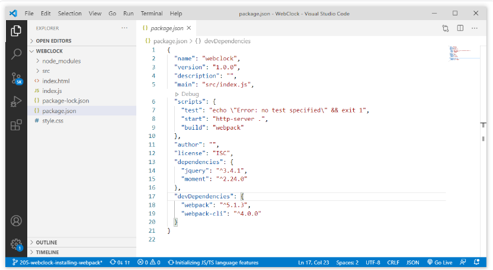
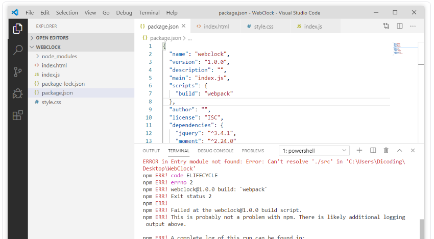
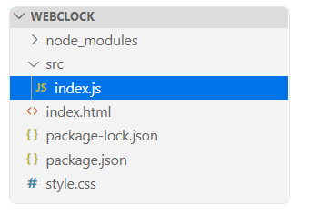
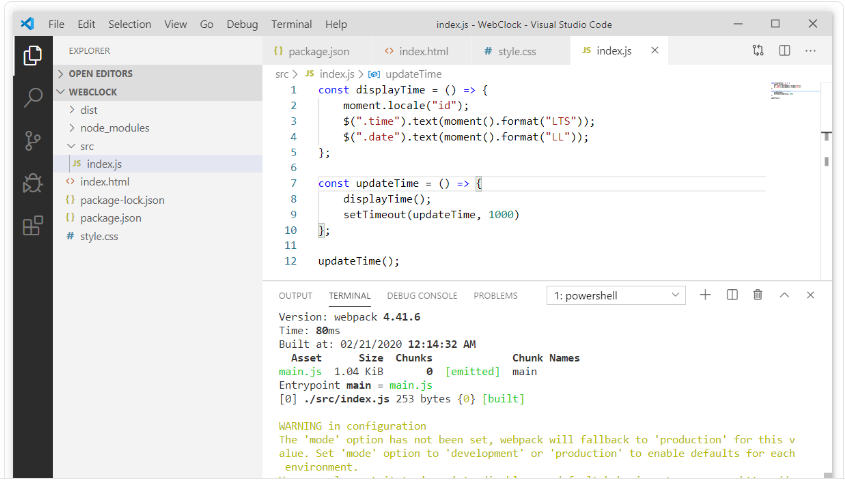
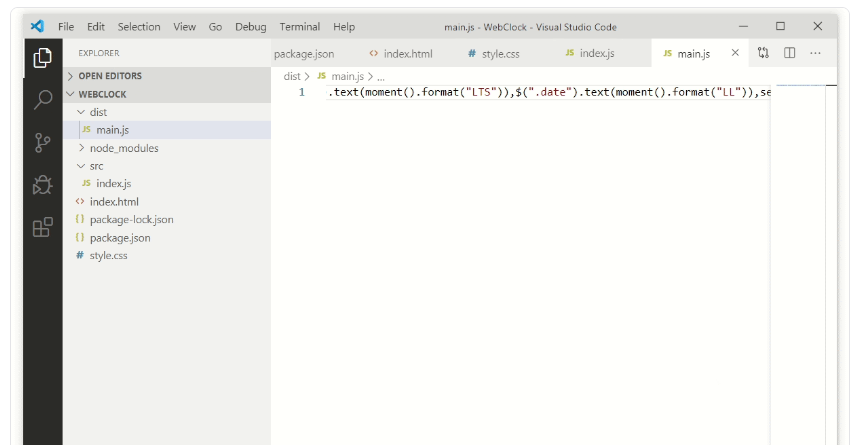
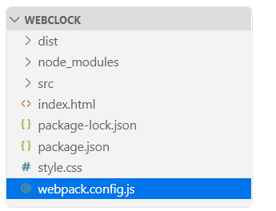
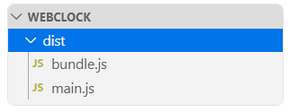
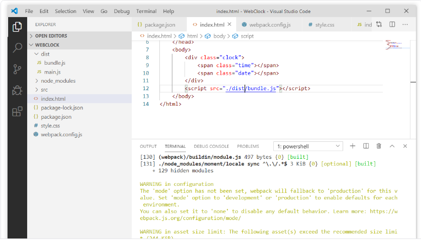

# Memasang Webpack
Memasang webpack pada proyek kita sama seperti kita memasang package JQuery atau Moment.js. Namun webpack ini dipasang pada devDependencies karena sejatinya ia hanya digunakan selama proses pengembangan saja. 

Untuk memasang webpack silakan buka proyek Anda. Pada terminal kita tuliskan perintah berikut:


```
npm install webpack --save-dev
npm install webpack-cli --save-dev
```

Atau kita dapat menyingkat perintah tersebut dalam penulisan satu baris seperti ini:

```
npm install webpack webpack-cli --save-dev
```

Setelah berhasil memasang package webpack dan webpack-cli, maka kita dapat melihat kedua package tersebut pada devDependencies di berkas package.json.




Mengapa kita membutuhkan dua package dalam memasang webpack? Apa fungsi package webpack dan webpack-cli? Package webpack merupakan package inti dari webpack itu sendiri. Sedangkan package webpack-cli merupakan package yang digunakan untuk membantu kita menjalankan webpack melalui sebuah perintah (Command Line Interface). Pada CLI kita juga dapat memberikan argumen seperti menetapkan berkas webpack config atau mode dalam proses build.

Untuk menjalankan webpack kita perlu menambahkan script dengan perintah webpack pada package.json seperti ini:

```
"scripts": {
  "test": "echo \"Error: no test specified\" && exit 1",
  "start": "http-server .",
  "build": "webpack"
},
```

Mengapa kita membutuhkan dua package dalam memasang webpack? Apa fungsi package webpack dan webpack-cli? Package webpack merupakan package inti dari webpack itu sendiri. Sedangkan package webpack-cli merupakan package yang digunakan untuk membantu kita menjalankan webpack melalui sebuah perintah (Command Line Interface). Pada CLI kita juga dapat memberikan argumen seperti menetapkan berkas webpack config atau mode dalam proses build.

Untuk menjalankan webpack kita perlu menambahkan script dengan perintah webpack pada package.json seperti ini:

```
"scripts": {
  "test": "echo \"Error: no test specified\" && exit 1",
  "start": "http-server .",
  "build": "webpack"
},
```

Kita bisa menghapus script yang lainnya karena sudah tidak akan kita gunakan lagi. Dengan demikian, berkas package.json akan tampak seperti ini:

```
{
  "name": "webclock",
  "version": "1.0.0",
  "description": "",
  "main": "index.js",
  "scripts": {
    "build": "webpack"
  },
  "author": "",
  "license": "ISC",
  "dependencies": {
    "jquery": "^3.4.1",
    "moment": "^2.24.0"
  },
  "devDependencies": {
    "webpack": "^5.1.3",
    "webpack-cli": "^4.0.0"
  }
}
```

Lalu, untuk menjalankan script build, kita gunakan perintah berikut:


```
npm run build
```

Namun, untuk saat ini jika menjalankan script build akan terjadi error seperti ini:



Dari pesan berikut, kita dapat menyimpulkan bahwa ketika kita tidak/belum menetapkan webpack configuration, nilai entry standar-nya akan berlokasi pada src -> index.js. 


```
ERROR in Entry module not found: Error: Can't resolve './src' in 'C:\Users\Dicoding\Desktop\WebClock'
```
Untuk itu, mari kita sesuaikan dengan membuat folder src dan memindahkan index.js pada folder tersebut. Sehingga struktur proyeknya akan tampak seperti ini:



Lalu, coba kita jalankan kembali script build, maka hasilnya akan tampak seperti ini.




Pada struktur proyek kita juga terlihat terdapat folder baru dengan nama dist, di mana di dalamnya terdapat berkas main.js yang merupakan hasil bundel dari entry point src -> index.js. 

Jika kita buka berkas tersebut, akan tampil banyak kode yang sulit kita baca. Jangan khawatir mengenai kode yang dihasilkan webpack itu. Namun, jika dilihat pada akhir kodenya, kita akan menemukan kode asli yang kita tulis.




Karena kita sudah menggunakan webpack untuk membundel module. Kita dapat menggunakan perintah import pada src -> index.js dalam menggunakan package npm.

```
import $ from 'jquery';
import moment from 'moment';
 
const displayTime = () => {
  moment.locale('id');
  $('.time').text(moment().format('LTS'));
  $('.date').text(moment().format('LL'));
};
 
const updateTime = () => {
  displayTime();
  setTimeout(updateTime, 1000);
};
 
updateTime();
```

Kemudian pada index.html, kita dapat menggantikan seluruh tag ```<script>``` yang ada dengan satu tag ```<script>``` yang ditujukan pada dist -> main.js.

```
<!DOCTYPE html>
<html>
<head>
  <title>Clock Web</title>
  <link rel="stylesheet" href="style.css">
</head>
<body>
  <div class="clock">
    <span class="time"></span>
    <span class="date"></span>
  </div>
  <script src="./dist/main.js"></script>

</body>
</html>
```


Lalu kita build ulang proyek dengan menjalankan perintah:

```
npm run build
```

Setelah build selesai dan menghasilkan berkas dist -> main.js yang baru, proyek WebClock seharusnya sudah bisa berjalan dengan baik ketika kita membuka berkas index.html.

### Membuat Berkas Konfigurasi
Sebelumnya kita menggunakan webpack dengan zero configuration. Apa artinya? Kita dapat menggunakan webpack tanpa membuat berkas webpack configuration sama sekali. Zero Configuration ini fitur yang sudah tersedia sejak webpack menginjak di versi 4. Namun, kekurangan dalam zero configuration adalah kita tidak dapat menyesuaikan konfigurasi webpack yang kita inginkan. Katakanlah jika kita ingin menerapkan loader atau plugin, tentu dengan Zero Configuration kita tidak dapat menerapkannya.

Kita dapat membuat berkas webpack configuration dengan membuat berkas JavaScript baru dengan nama webpack.config.js pada root folder proyek kita.





Nama berkas tersebut merupakan nama standar bagi berkas webpack configuration. Kita dapat menetapkan nama lain sesuka kita namun kita perlu menambahkan argument --config pada webpack CLI. Kita akan mencoba hal ini nanti. Saat ini, kita fokus terlebih dahulu pada bagaimana cara menuliskan kode konfigurasi pada webpack configuration.

Pada materi sebelumnya, kita sudah mengenal konsep inti dari webpack ini. Ada entry, output, loader, plugins dan mode. Kelima konsep inti tersebut akan menentukan perilaku webpack dalam melaksanakan tugasnya. Untuk konfigurasi awal, kita tetapkan terlebih dahulu entry dan output pada webpack configuration. Caranya dengan tambahkan kode berikut pada berkas webpack.config.js.

```
const path = require('path');
 
module.exports = {
  entry: './src/index.js',
  output: {
    path: path.resolve(__dirname, 'dist'),
    filename: 'bundle.js'
  }
};

```

Secara default, meskipun webpack telah mengatur nilai standar di dalam properti entry sebagai output bundle dari berkas javascript, tetapi kita tetap menuliskannya agar terlihat jelas berkas utama mana yang akan dijadikan sebagai berkas javascript utama. Selain itu, kita juga mengubah nilai output sebagai penamaan berkas hasil bundle dari main.js (nilai standar) menjadi bundle.js. Dengan demikian, ketika kita jalankan kembali script build di terminal dengan:


```
npm run build
```

Maka akan terdapat berkas bundel baru bernama bundle.js.



Namun, kita juga masih dapat melihat berkas main.js yang merupakan berkas lama hasil proses build sebelumnya. Kita dapat menghapusnya karena sudah tidak digunakan lagi. Namun, jangan lupa mengubah target berkas JavaScript yang dilampirkan pada index.html menjadi bundle.js.

Jika kita membuka index.html maka akan tampil hasil yang sama seperti sebelumnya. Karena memang kita tidak melakukan apa pun selain mengubah nama hasil bundel dari main.js (nilai standar) menjadi bundle.js.

Pada saat proses bundle, coba kita lihat pada Terminal. Terdapat warning yang menunjukkan bahwa kita tidak menetapkan mode pada berkas webpack configuration.



Jika kita tidak menetapkan nilai pada properti mode maka nilai standar akan diterapkan, yakni nilai production. Namun, ketimbang kita tidak menetapkan nilai pada properti mode, sebaiknya kita tetapkan saja nilai modenya agar tidak muncul warning message (pesan peringatan) dari webpack lagi tentangnya. Silakan kita tambahkan properti mode dengan nilai production seperti berikut.

