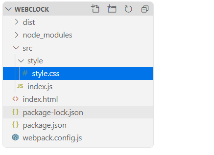
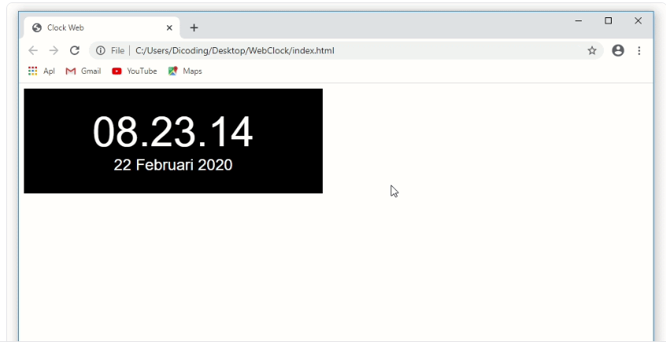
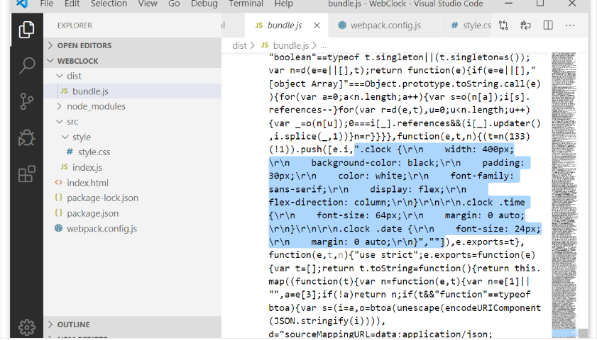

# Menggunakan Loader
Pada penjelasan core concepts kita sudah tahu bahwa dengan loader, webpack dapat memproses berkas selain JavaScript. Dengan adanya loader kita dapat menggunakan CSS sebagai modul dan ikut terbundel bersama berkas bundle.js. Sehingga kita tidak perlu lagi menerapkan tag <link> pada index.html.

### Style dan CSS Loader
Untuk menggunakan CSS modul pada webpack, kita membutuhkan dua buah loader. Yang pertama css-loader dan yang kedua style-loader. css-loader merupakan loader untuk memproses berkas dengan format .css. Sedangkan style-loader merupakan loader yang digunakan untuk membuat styling dapat diterapkan secara modular dengan menggunakan import statement. 

Untuk menggunakan kedua loader tersebut, langkah pertama adalah memasangnya melalui npm dengan perintah: 

```
npm install style-loader css-loader --save-dev
```

Setelah berhasil, pada berkas webpack.config.js kita tambahkan properti module.rules dan isikan nilai loader seperti ini:

```
const path = require('path');
 
module.exports = {
  entry: './src/index.js',
  output: {
    path: path.resolve(__dirname, 'dist'),
    filename: 'bundle.js'
  },
  mode: 'production',
  module: {
    rules: [
      {
        test: /\.css$/,
        use: [
          {
            loader: 'style-loader'
          },
          {
            loader: 'css-loader'
          }
        ]
      }
    ]
  }
}
```

Setelah menambahkan loader pada webpack.config.js, sekarang kita dapat melakukan impor berkas CSS menggunakan import statement layaknya berkas JavaScript.

Namun sebelum itu, pindahkan terlebih dahulu berkas style.css agar lebih rapi ke dalam direktori baru dengan lokasi src -> style -> style.css. Sehingga struktur proyek akan tampak seperti ini:



Lalu pada berkas index.js, lakukan impor berkas style.css pada awal baris kodenya.

```
import './style/style.css';
```

Dengan begitu kita tidak membutuhkan lagi tag <link> pada index.html dalam melampirkan stylesheet pada berkas style.css. Kita hapus tag <link> berikut:

```
<link rel="stylesheet" href="style.css">
```

Sehingga keseluruhan kode pada index.html akan tampak seperti ini:

```
<!DOCTYPE html>
<html>
<head>
  <title>Clock Web</title>
</head>
<body>
  <div class="clock">
    <span class="time"></span>
    <span class="date"></span>
  </div>
  <script src="./dist/bundle.js"></script>
</body>
</html>
```

Setelah itu, silakan jalankan kembali script build untuk menghasilkan berkas bundle.js yang baru dan buka index.html pada browser. Seharusnya proyek WebClock menampilkan hasil yang sama seperti sebelumnya.



Selamat! Itu artinya, Anda berhasil menerapkan styling dengan cara modular menggunakan webpack loader. Jika Anda lihat pada berkas bundle.js saat ini, kita dapat menemukan styling yang dituliskan. 

