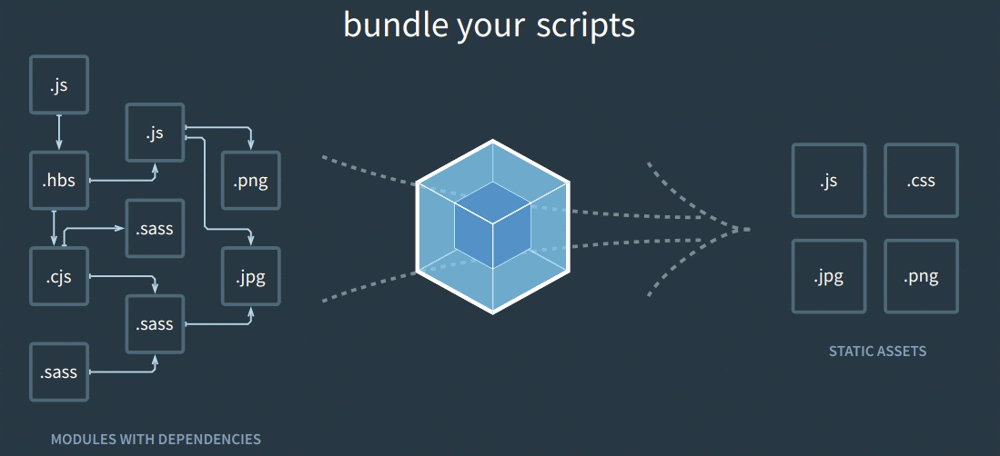
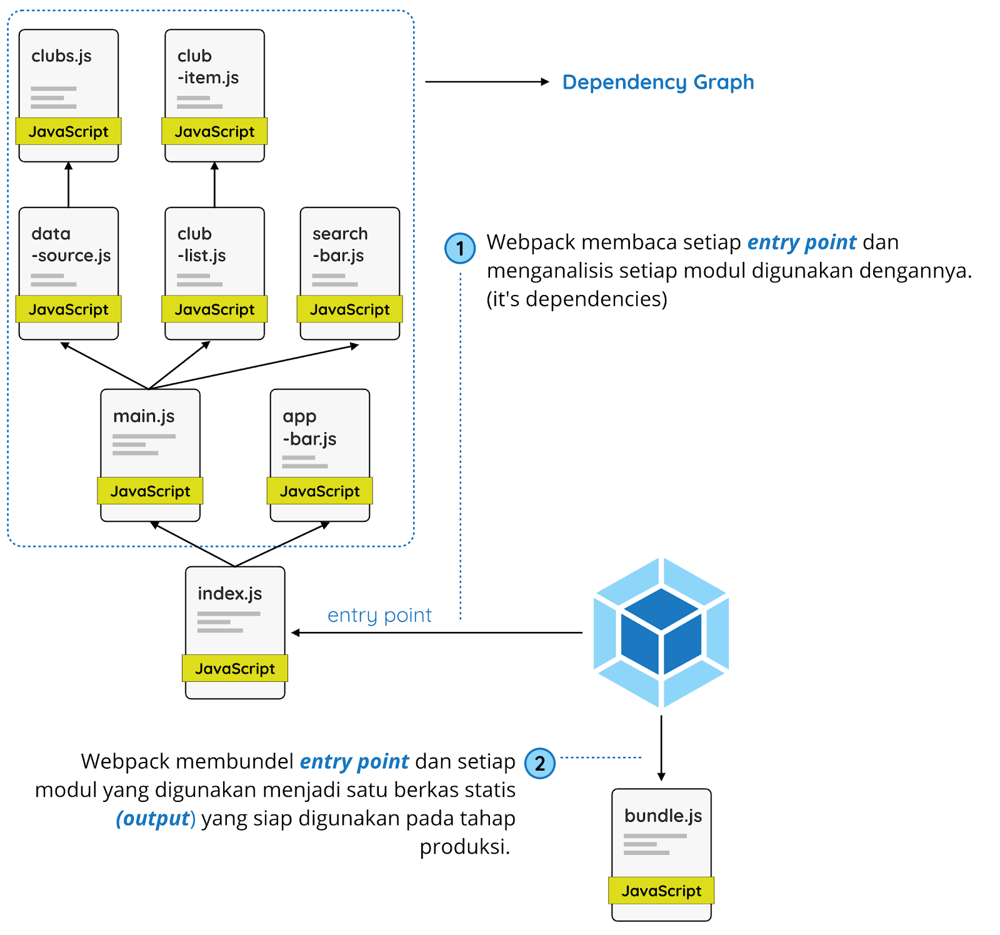
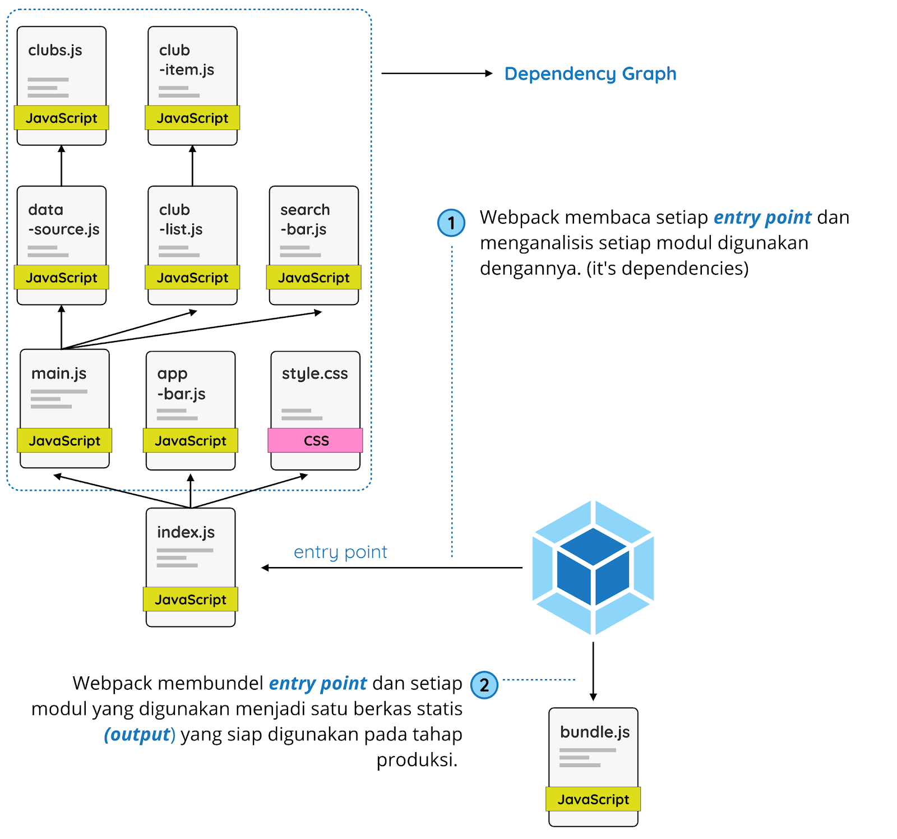
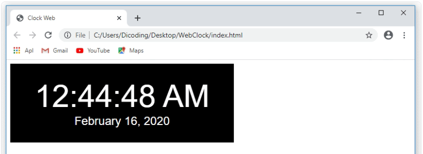

### Pendahuluan Module Bundler

Salah satu module bundler yang populer digunakan pada saat ini adalah Webpack. Dengan ini, kita dapat mengubah dynamic code dan modules menjadi static code (kode yang siap digunakan pada tahap production). 

### Apa itu Webpack

Pada dasarnya, webpack merupakan salah satu module bundler untuk aplikasi JavaScript modern. Ketika webpack dijalankan pada proyek, webpack akan mengobservasi module apa saja yang kita digunakan dan membuat modul-modul tersebut dibungkus menjadi satu berkas (atau lebih) di belakang layar.




Dengan menggunakan Webpack, kita dapat leluasa menggunakan module yang saling bergantungan. Webpack akan menggabungkan seluruh module yang digunakan baik itu modul yang kita tuliskan sendiri atau module yang kita dapatkan melalui NPM menjadi static assets yang siap digunakan pada tahap produksi.

Webpack pertama kali rilis pada 10 Maret 2012. Sebelum ada webpack, sebenarnya sudah ada tools lain yang serupa seperti Browserify. Disamping sebagai module bundler, sejatinya ia memiliki tujuan sebagai tools yang dapat membawa node package apa pun agar dapat berjalan pada browser (kita dapat melihat tujuan dari namanya, “Browserify”).


Secara tidak langsung, browserify perlu berperan sebagai module bundler. Sebabnya, ketika menggunakan node package, tentu package tersebut terpisah dari kode yang kita tuliskan sendiri. Untuk menggabungkannya, Node.js menggunakan perintah require(). Dengan menggunakan browserify ini, perintah require() tersebut dapat kita gunakan pada browser (melalui transpiling).

Dari segi konsep, browserify dan webpack sangatlah berbeda. Namun kita dapat mengkategorikan keduanya sebagai module bundler. Kelebihan webpack dibandingkan dengan browserify adalah webpack dapat memproses berkas/modul lain di luar JavaScript seperti TypeScript atau Sass tanpa bantuan task runner seperti Grunt atau Gulp.

Sekitar awal tahun 2014 hingga pertengahan tahun 2015, Browserify ini populer digunakan oleh para developer. Hingga pada akhir tahun 2015, webpack-lah yang menggantikan kepopulerannya. Saat ini, webpack sudah menyentuh versi 5.


# Core Concepts
Untuk lebih memahami bagaimana webpack bekerja, ketahui dulu core concepts yang ada pada webpack.





Terdapat 5 (lima) konsep penting dalam webpack yang perlu kita ketahui sebelum menggunakan webpack itu sendiri. Dari 5 (lima) konsep tersebut, kita tahu bagaimana perilaku dari webpack ketika ia dijalankan. Berikut ini adalah penjelasan singkat dari kelima konsep tersebut.

* Entry : Titik awal di mana webpack akan menganalisa berkas dan membentuk dependency graph.
* Output : Berkas bundel yang dihasilkan dari berkas-berkas yang dianalisis webpack berdasarkan entry point.
* Loaders :  Transformation tools pada webpack, yang akan memproses setiap berkas selain JavaScript atau JSON yang kita impor menjadi format yang dapat digunakan ke tahap produksi.
* Plugin :  Digunakan untuk melakukan tugas seperti optimasi bundel, management aset dan sebagainya.
* Mode : Kondisi yang digunakan webpack sebagai acuan optimasi apa saja yang harus diterapkan dalam melakukan tugasnya. Dalam mode kita dapat menetapkan nilai production, development atau pun none.

### Entry
Entry atau entry point merupakan modul pertama yang akan dianalisa oleh webpack ketika ia dijalankan. Melalui entry point inilah webpack akan membentuk dependency graph. Webpack akan mencari tahu modul lain yang digunakan pada entry point dan menggabungkannya menjadi satu static assets.

Pada standarnya, nilai entry point akan ditempatkan pada ./src/index.js. Namun kita dapat menetapkan lokasi yang berbeda dengan mengatur properti entry pada berkas webpack configuration (webpack.config.js). Contohnya:


```
module.exports = {
  entry: './path/to/my/entry/file.js'
};
```

Kode di atas merupakan cara cepat dalam penulisan properti entry. Sebenarnya entry dapat berupa objek seperti ini:

```
module.exports = {
  entry: {
    main: './path/to/my/entry/file.js'
  }
};
```

Kita bisa memanfaatkan objek sebagai nilai entry ketika terdapat banyak entry point yang ingin kita tetapkan.

```
module.exports = {
  entry: {
    app: './src/app.js',
    adminApp: './src/adminApp.js'
  }
};
```

### Output
Output merupakan salah satu properti yang terdapat pada webpack configuration. Properti ini berfungsi untuk memberitahu webpack di mana dan bagaimana lokasi static assets yang telah dibundel harus disimpan dan diberi nama. Standarnya lokasi penyimpanannya berada pada dist -> main.js. Lokasi dist merupakan lokasi standar untuk menyimpan berkas yang dihasilkan oleh webpack.

Kita dapat mengkonfigurasi bagian output ini melalui properti output pada webpack.config.js seperti contoh berikut ini:


```
const path = require('path');
 
module.exports = {
  entry: './path/to/my/entry/file.js',
  output: {
    path: path.resolve(__dirname, 'dist'),
    filename: 'my-first-webpack.bundle.js'
  }
};
```

Pada contoh di atas, kita menggunakan output.filename dan output.path properties untuk memberitahu webpack mengenai penamaan dan lokasi static assets yang sudah dibundel. Pada contoh di atas, kita juga dapat melihat modul path yang diimpor menggunakan Node.js module. Modul tersebut merupakan modul standar pada Node.js yang digunakan untuk memanipulasi lokasi berkas. Untuk memahami lebih dalam mengenai module path, silakan cek https://nodejs.org/api/path.html.

Jika kita menetapkan lebih dari satu entry point, kita perlu menggunakan substitution untuk memastikan berkas yang dihasilkan webpack memiliki nama unik.

```
module.exports = {
  entry: {
    app: './src/app.js',
    search: './src/search.js'
  },
  output: {
    filename: '[name].js',
    path: __dirname + '/dist'
  }
};
 
// webpack akan menghasilkan: ./dist/app.js, ./dist/search.js
```

Properti output memiliki banyak fitur dalam proses konfigurasinya. Jika Anda ingin belajar lebih dalam seputar penggunaannya, silakan cek dokumentasi webpack berikut: https://webpack.js.org/configuration/output/

### Loaders
Dalam melaksanakan tugas, sejatinya Webpack hanya mengenali berkas JavaScript dan JSON. Namun melalui loaders, Webpack dapat memproses berkas berformat lain seperti css, sass, pug, jsx, atau yang lainnya. Loaders merupakan sebuah transformation tools pada Webpack yang akan memproses setiap berkas selain JavaScript atau JSON yang kita impor menjadi format yang dapat digunakan ke tahap produksi.

Jika pada build tools lain seperti Gulp atau Grunt, loaders ini seperti “task”. Task ini sangat membantu dalam menangani proses front-end building. Loader dapat mengubah berkas bahasa pemrograman lain seperti TypeScript ke JavaScript. Yang paling spesial dari loader adalah kita dapat melakukan import berkas .css langsung pada entry point layaknya berkas JavaScript pada dependency graph.




Kemampuan impor pada modul apa pun (contohnya .css) merupakan fitur spesifik dari webpack yang mungkin tak akan kita jumpai pada module bundler atau task runner lain. Alhasil, kita dapat lebih leluasa lagi alias tak terbatas dengan tipe berkas dalam menggunakan modul pada webpack.

Untuk menetapkan loaders kita gunakan properti module.rules pada webpack configuration (webpack.config.js). Di dalamnya terdapat dua high level properties yaitu test, dan use. Berikut penjelasan singkatnya:

* Properti test merupakan tipe berkas yang akan ditransformasikan.
* Properti use merupakan loader mana yang akan digunakan untuk mentransformasikan berkas terkait.


Belum terbayang bagaimana penggunaannya, ya? Berikut contoh konfigurasi dari properti loader.

```
module.exports = {
  module: {
    rules: [
      { test: /\.css$/, use: 'css-loader' }
    ]
  }
};

```

Konfigurasi di atas memiliki properti module.rules dan menetapkan properti test dan use di dalamnya. Konfigurasi seperti ini layaknya kita memberitahu “Hey webpack compiler! Ketika Anda bertemu dengan berkas .css yang dihubungkan menggunakan import atau require statement, gunakanlah css-loader untuk mengubahnya sebelum membungkusnya ke dalam bundle.”

Banyak sekali loader yang dapat kita gunakan pada webpack configuration. Namun loader tersebut tidak disertakan langsung ketika kita menggunakan webpack. Jika kita ingin menggunakan loader katakanlah css-loader, maka kita perlu memasang package loader tersebut melalui npm.

```
npm install css-loader --save-dev
```

Contoh sebelumnya merupakan cara ringkas ketika kita menetapkan loader agar mudah dibaca. Melalui module.rules, sebenarnya kita dapat menetapkan banyak loader, namun dalam penulisannya kita perlu menetapkan loader tersebut secara eksplisit seperti ini:

```
module.exports = {
  module: {
    rules: [
      {
        test: /\.css$/,
        use: [
          {
            loader: "style-loader"
          },
          {
            loader: "css-loader"
          }
        ]
      }
    ]
  }
}
```

Dalam menuliskan banyak loader dalam satu rule, urutan deklarasi loader tersebut sangat berpengaruh. Loader akan tereksekusi dengan urutan dari bawah ke atas. Pada contoh di atas eksekusi akan dimulai dari css-loader, lalu dilanjutkan oleh style-loader.

Dengan menuliskan loader secara eksplisit seperti ini, kita juga dapat dengan mudah menambahkan konfigurasi pada loader yang digunakan melalui properti options. Contohnya:

```
module.exports = {
  module: {
    rules: [
      {
        test: /\.css$/,
        use: [
          {
            loader: "style-loader",
            options: {
              // memasukkan style dengan tag <style> di bawah dari element <body> 
              insert: "body"
            }
          },
          {
            loader: "css-loader"
          }
        ]
      }
    ]
  }
}
```

Untuk melihat loader apa saja yang dapat kita manfaatkan pada webpack dan konfigurasi apa saja yang dapat diterapkan pada masing-masing loadernya, kita dapat melihatnya secara lengkap pada dokumentasi resmi webpack melalui tautan berikut:

https://webpack.js.org/loaders/

### Plugin
Plugin pada webpack digunakan untuk melakukan tugas seperti optimasi bundel, management aset, dan sebagainya. Dengan adanya plugin ini, webpack menjadi lebih fleksibel. Plugin merupakan tulang punggung dari webpack. Bahkan webpack sendiri dibangun menggunakan sistem plugin yang sama seperti yang kita lakukan pada webpack configuration.

Webpack Plugin merupakan sebuah JavaScript objek yang dibangun menggunakan JavaScript class yang di dalamnya terdapat method apply dengan satu argument bernama compiler. Kita dapat membuat webpack plugin sederhana dengan cara seperti ini: 

```
const pluginName = 'ConsoleLogOnBuildWebpackPlugin';
 
class ConsoleLogOnBuildWebpackPlugin {
  constructor(options) {
    this.options = options;
  }
 
  apply(compiler) {
    compiler.hooks.run.tap(pluginName, compilation => {
      console.log(this.options.message);
    });
  }
}
 
module.exports = ConsoleLogOnBuildWebpackPlugin;
```

Ketika kita menggunakan plugin tersebut pada webpack configuration, ia akan mencetak nilai this.options.message pada console ketika proses build pada webpack berjalan. 

Untuk saat ini jangan terfokus pada cara membuat plugin di webpack. Alih-alih, fokuslah pada bagaimana ia digunakan pada webpack configuration. Karena plugin merupakan objek dan kita mungkin menyimpan konfigurasi ketika ia dibuat, maka dalam membuat objek plugin kita perlu menggunakan keyword new seperti ini:

```
const ConsoleLogOnBuildWebpackPlugin = require('./console-log-on-build-webpack-plugin.js');
 
module.exports = {
  plugins: [
    new ConsoleLogOnBuildWebpackPlugin({
      message: 'The webpack build process is starting!'
    })
  ]
}
```

Banyak plugin, baik standar webpack atau pihak ketiga, yang dapat kita manfaatkan pada webpack. Oleh sebab itulah, kita tidak perlu fokus pada bagaimana membuat plugin. Untuk menggunakan plugin standar webpack, kita dapat mengaksesnya melalui objek webpack seperti ini.

```
const webpack = require('webpack'); // dibutuhkan untuk mengakses built-in plugins
 
module.exports = {
  plugins: [
    new webpack.ProgressPlugin()
  ]
}
```

Namun, untuk menggunakan beberapa plugin (di luar plugin standar yang disediakan) kita perlu memasangnya terlebih dahulu melalui npm. Contohnya plugin yang banyak digunakan untuk membuat berkas HTML pada webpack adalah html-webpack-plugin. Untuk memasangnya kita gunakan perintah berikut:

```
npm install html-webpack-plugin --save-dev
```


Setelah memasangnya kita dapat menggunakannya pada webpack configuration seperti ini:

```
const HtmlWebpackPlugin = require('html-webpack-plugin'); //dipasang via npm
 
module.exports = {
  plugins: [
    new HtmlWebpackPlugin({
      template: './src/index.html',
      filename: 'index.html'
    })
  ]
};
```

Pada contoh di atas, melalui html-webpack-plugin, webpack akan menghasilkan berkas HTML untuk proyek kita dan memasukkan berkas yang sudah dibundel.

### Mode
mode merupakan salah satu properti yang terdapat pada webpack configuration. Dengan memberikan mode dengan nilai development, production, atau none, kita dapat melakukan optimasi pada webpack berdasarkan mode yang kita kehendaki. Jika kita tidak menetapkan nilai pada properti mode, secara default akan bernilai production.

```
module.exports = {
  mode: 'production'
};

```


Nilai mode juga dapat kita tetapkan melalui CLI argument seperti berikut:

```
webpack --mode development
```

Kita dapat melakukan optimasi pada webpack berdasarkan mode yang kita kehendaki karena tiap properti pada webpack configuration menyesuaikan pada modenya. Misalkan, jika kita menggunakan mode development, kita dapat menggunakan properti devtool, cache, atau properti development lainnya pada webpack configuration.

```
module.exports = {
  mode: 'development',
  devtool: 'eval',
  cache: 'true'
}
```

Properti devtool atau cache tentu tidak dapat kita gunakan dalam mode production, tetapi kita dapat memanfaatkan properti-properti yang terdapat pada production. Begitu juga ketika kita menetapkan mode none. Untuk lebih lengkapnya, properti apa saja yang dapat kita manfaatkan di masing-masing mode-nya, silakan cek tautan berikut: https://webpack.js.org/configuration/mode/

Jika kita ingin mengubah perilaku webpack berdasarkan nilai mode di dalam webpack.config.js, ubahlah module.exports dari obyek ke fungsi.


```
const config = {
  entry: './app.js'
  //...
};
```
 
```
module.exports = (env, argv) => {
  if (argv.mode === 'development') {
    config.devtool = 'source-map';
  }
 
  if (argv.mode === 'production') {
    //...
  }
 
  return config;
};

```


Selain itu, kita dapat menggunakan flag --config pada scripts berkas package.json untuk menetapkan berkas webpack configuration yang berbeda pada tiap modenya.


```
"scripts": {
  "build:prod": "webpack --config webpack.prod.js",
  "build:dev": "webpack --config webpack.dev.js"
}

```

# Memasang dan Menggunakan Webpack
untuk pemasangan melanjutkan project repo ini: https://github.com/AsepSahrudin18/package_manager.git

Setelah menyimak apa itu webpack dan seperti apa core concepts-nya, mungkin sebagian dari kita masih bingung jika belum mencobanya langsung. Untuk itu, mari kita coba terapkan webpack pada proyek WebClock yang sudah kita buat sebelumnya karena pada proyek tersebut kita masih menggunakan tag dalam menggunakan package yang terpasang menggunakan npm.

Sebelum melanjutkan ke materi selanjutnya, pastikan Anda ikuti instruksi pada modul Node Package Manager (npm) hingga proyek WebClock menghadirkan tampilan seperti ini:



